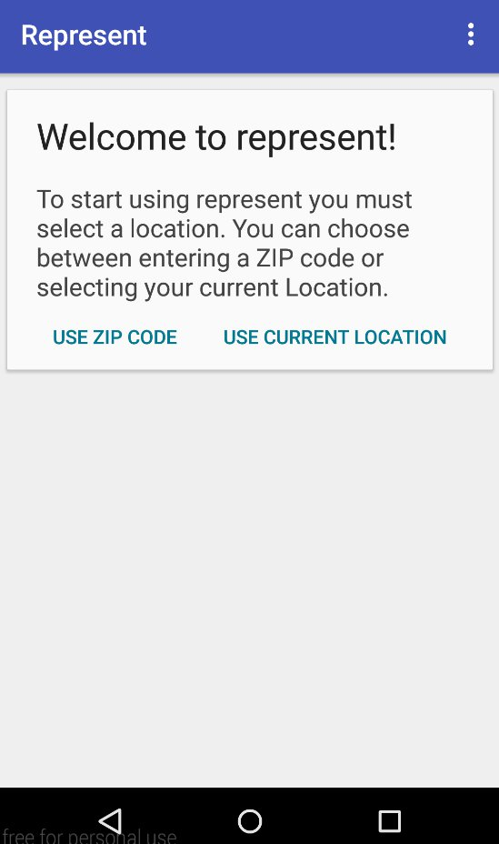
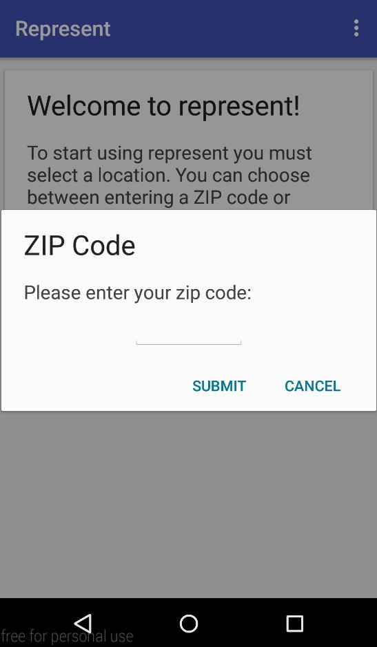
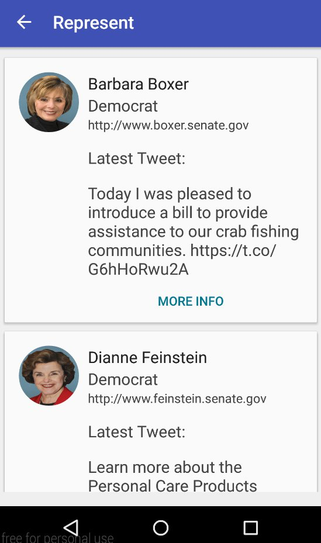
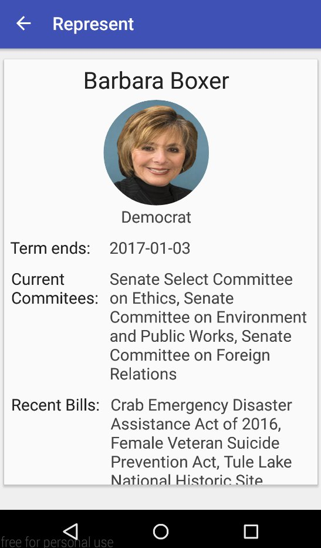
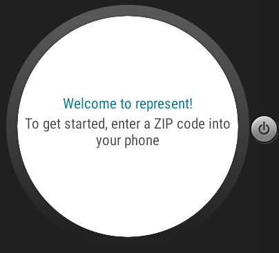
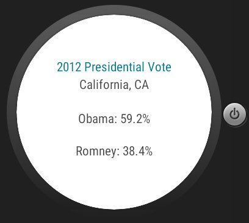
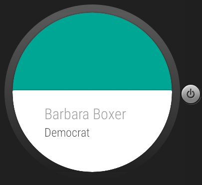

# PROG 02: Represent!

## Details:

Represent is an app that gives congressional information based on given location. It uses the sunlight, picasso, fabric, and maps api. It has its features split with a companion smartwatch app. The location can be given in 2 ways, the user can give a zip code by pressing the “USE ZIP CODE” button in the main page. It will open a box where the user enters a zip code. The zip code box attempts to verify to check if a zip code is valid before bringing the users to the next view. The user can also use the “USE CURRENT LOCATION” button to automatically use current gps location coordinates to make an api call without entering information. This only works if gps is on and there is a valid internet connection. Once valid data is entered the phone app will open the congress view and the watch will leave the splash screen and enter the main watch view. In the phone congress view users will see 2 current senators and one current representative. They will received summarized information, their political party, website, and latest tweet. On the watch main view the user will see the name of the congressperson and their party. They will know if the congressperson is a senator or representative by the color background (green is senator, blue is representative). The user will be able to swipe down the see the rest of the congresspeople. 

On a swipe left on the watch app, the user will enter the 2012 Voting View. There they will be able to see voting % data for Obama and Romney in the 2012 election. Senators will get data for the state they represent. Representatives will get data from the specific county they represent. On a tap in the main watch view, the user will be able to see the detailed view on the phone app. They can also enter the detailed view from the phone app by pressing the “MORE INFO” button in the detailed view. The detailed view will show the term end, committees, and recent bills of the chosen representatives. This view is scrollable.

Lastly, if the watch app out of the splash screen, the user can shake the watch and a random location will be generated and a new congressional view will be opened on the phone as well as a new main view on the watch (a toast will appear on the watch to signify that the shake has been registered).

## Authors

Jeremy Diaz (j.jeremy.diaz@berkeley.edu)

## Github Link

https://github.com/cs160-sp16/prog-02-represent-jjeremydiaz

## Demo Video

See http://youtu.be/QZ7J_AWzmFA?hd=1

## Screenshots

Main View  

Entering Zip Code  

Congressional View  

Detailed View  

Watch Splash View <br/ >

Watch Vote View  

Watch Main View  

## Acknowledgments

* Many functions were taken and modified from stackoverflow, links to particular pages are commented on top of the function in the source code.
* Many helpful hints were given out on piazza by other students and gsi’s.
* Google’s api guides and class documentations were really useful for implemented certain features.
